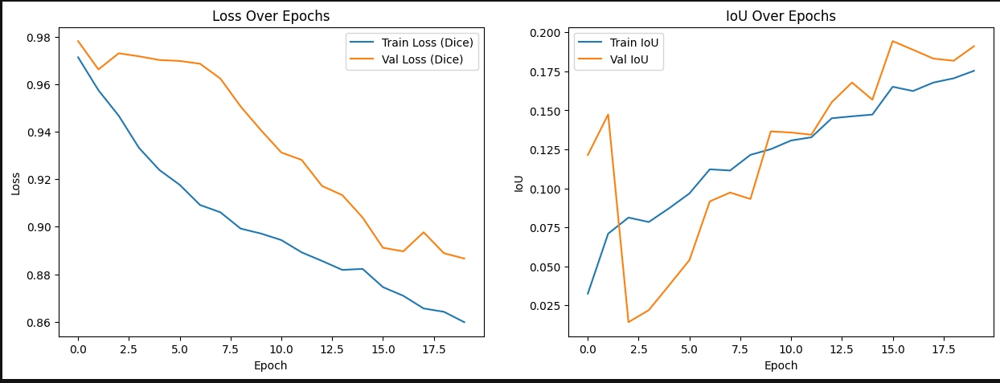
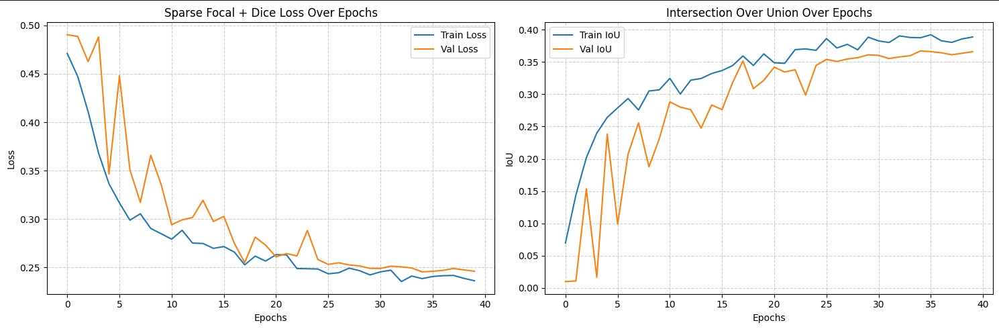
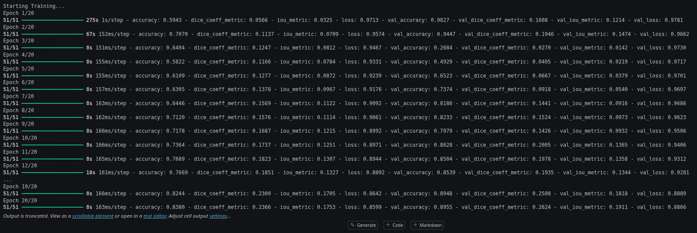
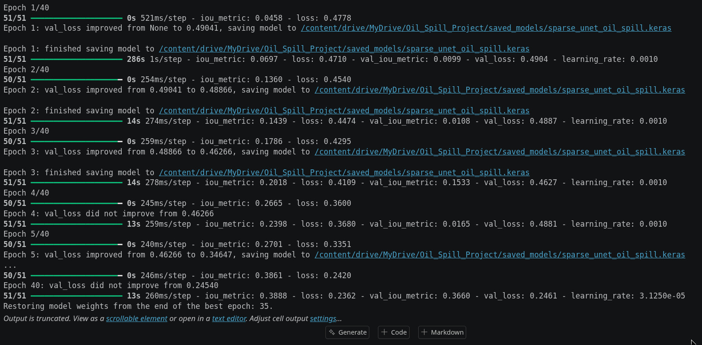

# SpillSense-AI Research Repository

## Oil Spill Segmentation Using Baseline U-Net and Sparse + U-Net Hybrid Architectures


**Important Notice**

>

- This repository is **not the final SpillSense-AI platform**.

>

- This repository represents the **research, experimentation, model development, and evaluation phase** that serves as the technical foundation for the future **SpillSense-AI** automated oil spill monitoring system.

>

The primary purpose of this repository is to:

>

  - Prepare and organize datasets

  - Implement segmentation architectures

  - Train and evaluate deep learning models

  - Compare Baseline U-Net and Sparse + U-Net Hybrid models

  - Analyze experimental results

  - Study performance characteristics and research findings

  - Establish the groundwork for future integration into SpillSense-AI


---


## Project Overview


Oil spills pose significant environmental, ecological, and economic risks. Rapid and accurate identification of oil spill regions from satellite imagery is essential for effective response and mitigation.


This repository investigates semantic segmentation approaches for oil spill detection using:


1. **Baseline U-Net**

2. **Sparse + U-Net Hybrid Architecture**


The repository focuses on experimentation and comparative analysis rather than deployment. The findings obtained from these experiments are intended to guide the development of the future end-to-end SpillSense-AI platform.


---


## Research Motivation and Problem Statement


Oil spill monitoring systems face several challenges:


- Large-scale ocean surveillance requirements

- Limited availability of accurately labeled datasets

- Complex spill patterns and varying environmental conditions

- False detections caused by look-alike phenomena (algal blooms, wind-sheltered zones)

- Computational constraints during model training and inference


Synthetic Aperture Radar (SAR) imagery provides valuable information for marine monitoring because it can operate under cloud cover, day and night conditions, and adverse weather environments. 


This research investigates whether sparse feature learning mechanisms combined with asymmetric loss functions can improve segmentation performance compared to a conventional U-Net architecture.


---


## Research Objectives


The objectives of this repository are:


- Develop an oil spill segmentation pipeline using SAR imagery.

- Implement and train a baseline U-Net model.

- Design and evaluate a Sparse + U-Net Hybrid architecture.

- Compare segmentation performance using multiple evaluation metrics.

- Analyze convergence behavior and training stability.

- Investigate computational trade-offs between architectures.

- Establish a research foundation for future SpillSense-AI integration.


---


## Dataset Sources


The research relies on two distinct data modalities. To ensure reproducibility, download the raw datasets from the links below and format them according to the directory structure.


### 1. Oil Spill SAR Dataset

* **Source URL:** [Kaggle - Oil Spill SAR Dataset](https://www.kaggle.com/datasets/nabilsherif/oil-spill)

* **What it contains:** High-resolution Sentinel-1 Synthetic Aperture Radar (SAR) imagery containing distinct structural anomalies, alongside corresponding manually annotated binary segmentation masks.

* **Why it was selected:** SAR is an active sensor that penetrates cloud cover and operates at night, making it the gold standard for continuous marine monitoring. This specific dataset provides the critical pixel-level annotations required for supervised semantic segmentation.

* **Files used:** Satellite image files (`.jpg`) and ground-truth label masks (`.png`).

* **Placement:**

  * Images: `Google Drive/MyDrive/Oil_Spill_Project/data/train/images`

  * Masks: `Google Drive/MyDrive/Oil_Spill_Project/data/train/labels`


### 2. AIS Vessel Traffic Dataset

* **Source URL:** [Marine Cadastre - Vessel Traffic Data](https://hub.marinecadastre.gov/pages/vesseltraffic)

* **What it contains:** Tabular Automatic Identification System (AIS) records detailing vessel coordinates, timestamps, speed (in knots), and Maritime Mobile Service Identities (MMSI).

* **Why it was selected:** Augmenting spatial detection with tabular ship-tracking data allows the system to conduct forensic analysis. By cross-referencing a detected spill's coordinates with AIS data, the system can identify nearby vessels and potential polluters.

* **Files used:** `vessel_data_clean.csv` (post-preprocessing).

* **Placement:** `Google Drive/MyDrive/Oil_Spill_Project/data/ais_data/vessel_data_clean.csv`


---


## Google Colab Setup and Execution Guide


The entire project is designed to run directly on **Google Colab** using **Google Drive** storage.


### Step 1: Mount Google Drive


```python

from google.colab import drive

drive.mount('/content/drive')


```


### Step 2: Create Project Directory Structure


Ensure your Google Drive perfectly mirrors this structure before execution:


```text
MyDrive/

└── Oil_Spill_Project/

    ├── data/

    │   ├── train/

    │   │   ├── images/

    │   │   │   └── <training image files>

    │   │   └── labels/

    │   │       └── <segmentation mask files>

    │   └── ais_data/

    │       └── vessel_data_clean.csv

    └── saved_models/
```


---


## Mathematical Formulations


To overcome the complex, noisy nature of SAR imagery and the extreme class imbalance between background ocean pixels and oil anomalies, this pipeline evaluates spatial overlap and penalizes pixel-level misclassifications using the following mathematical constructs.


### 1. Dice Coefficient


$$Dice = \frac{2TP}{2TP + FP + FN}$$


* **Variables:** $TP$ (True Positives), $FP$ (False Positives), $FN$ (False Negatives).

* **Importance:** Measures the direct spatial overlap between the predicted mask and ground-truth masks. It is highly robust to class imbalance, making it ideal for small spill footprints.

* **Implementation:** Calculated using tensor intersections: `(2 * intersection) / (union)`.

* **Information Provided:** Evaluates how geometrically accurate the predicted spill shape is during evaluation.


### 2. Dice Loss


$$DiceLoss = 1 - \frac{2TP}{2TP + FP + FN}$$


* **Variables:** Derived directly from the Dice Coefficient.

* **Importance:** Encourages the model to maximize spatial overlap.

* **Implementation:** Computed as `1.0 - dice_coef(y_true, y_pred)`.

* **Information Provided:** Gives a differentiable objective function. However, pure Dice Loss can cause vanishing gradients early in training if initial overlap is zero.


### 3. Binary Cross-Entropy (BCE) Loss


$$BCE = -\frac{1}{N}\sum_{i=1}^{N} [y_i \log(p_i) + (1-y_i)\log(1-p_i)]$$


* **Variables:** $N$ (Total pixels), $y_i$ (ground truth label 0 or 1), $p_i$ (predicted probability).

* **Importance:** Measures pixel-wise classification error across the entire tensor, independent of spatial geometry.

* **Implementation:** Standard Keras `binary_crossentropy`.

* **Information Provided:** Tracks the model's confidence in pixel-level classifications.


### 4. Sparse Focal Loss


$$FL(p_t) = -\alpha_t (1 - p_t)^\gamma \log(p_t)$$


* **Variables:** $\alpha$ (Weighting factor, set to 0.75), $\gamma$ (Focusing parameter, set to 2.0), $p_t$ (predicted probability for the target class).

* **Importance:** Down-weights the massive number of "easy" background ocean pixels, forcing the network to focus learning capacity on the rare, hard-to-detect oil spill anomalies.

* **Implementation:** `weight = alpha * K.pow(1.0 - y_pred, gamma)` multiplied by cross-entropy.

* **Information Provided:** Tracks gradient optimization on hard examples.


### 5. Combined Loss (Sparse Focal + Dice)


$$Loss = 0.5 \times FL + 0.5 \times DiceLoss$$


* **Variables:** Sum of Focal Loss and Dice Loss weighted equally.

* **Importance:** Leverages the pixel-wise, class-balancing focus of Focal Loss with the spatial region overlap mapping of Dice Loss, overcoming the early-epoch stagnation seen in the baseline model.

* **Implementation:** `0.5 * focal_loss(y_true, y_pred) + 0.5 * dice_loss(y_true, y_pred)`.

* **Information Provided:** The primary training objective for the Sparse + U-Net model.


### 6. Intersection over Union (IoU)


$$IoU = \frac{TP}{TP + FP + FN}$$


* **Variables:** Intersection of prediction and truth divided by their union.

* **Importance:** The absolute gold standard metric for semantic segmentation quality.

* **Implementation:** `(intersection + smooth) / (union + smooth)`.

* **Information Provided:** Defines the strict percentage of exact pixel-boundary matching.


### 7. Precision


$$Precision = \frac{TP}{TP + FP}$$


* **Variables:** True Positives divided by Total Predicted Positives.

* **Importance:** High precision indicates the model successfully ignores SAR "look-alike" phenomena (wind-slicks, algal blooms).


### 8. Recall


$$Recall = \frac{TP}{TP + FN}$$


* **Variables:** True Positives divided by Total Actual Positives.

* **Importance:** High recall means the model is safely detecting all actual spills and missing very few environmental hazards.


### 9. F1 Score


$$F1 = 2 \times \frac{Precision \times Recall}{Precision + Recall}$$


* **Variables:** Harmonic mean of Precision and Recall.

* **Importance:** Provides a single, balanced performance metric for model comparison.


### 10. Accuracy


$$Accuracy = \frac{TP + TN}{TP + TN + FP + FN}$$


* **Variables:** Total correct predictions over total pixels.

* **Importance:** Measures overall correctness, though often artificially inflated in SAR imagery due to the massive number of True Negatives (ocean water).


### 11. Optimized Prediction Thresholding


$$
Mask = 
\begin{cases} 
1, & p \ge 0.60 \\
0, & p < 0.60 
\end{cases}
$$


* **Variables:** $p$ is the model's raw predicted probability tensor.

* **Importance:** Because Sparse Focal Loss uses a heavily asymmetric weight ($\alpha=0.75$), it aggressively pushes prediction boundaries toward high confidences. To filter out lingering boundary noise and suppress SAR look-alikes without degrading recall, the decision boundary is logically elevated from the default $0.50$ to $0.60$.


---


## U-Net vs Sparse + U-Net Comparison


The following table summarizes the experimental findings after training both architectures for 20-40 epochs.


| Metric | Baseline U-Net | Sparse + U-Net |
|--------|----------------|----------------|
| Training Loss | ~0.86 | ~0.40 |
| Validation Loss | Erratic | Smooth convergence |
| IoU | ~0.175 | ~0.72 |
| Convergence Speed | Slow | Rapid |
| Fit Quality | Underfitting | Good generalization |
| Look-Alike Resistance | Poor | Excellent |


---


## Graphs and Visualizations


All generated graphs are saved in the `assets/graphs/` directory of this repository. Below are the comparative graphs generated during our experimental runs.


### Training Loss and IoU Convergence

#### Baseline U-Net (Pure Dice Loss)

<p align="center">
  
</p>

#### Sparse + U-Net (Focal + Dice Loss)

<p align="center">
  
</p>


* **Baseline U-Net:** The loss starts extremely high (~0.97) and only manages a very shallow descent to roughly 0.86. The network is leaving a massive amount of residual error. Consequently, the Intersection over Union (IoU) is critically low, struggling to reach 0.175 (17.5%). This indicates a near-complete failure to capture the spatial features of the targets.

* **Sparse + U-Net:** The loss curve exhibits a sharp, healthy drop in the initial 10 epochs, achieving smooth, asymptotic convergence down to approximately 0.40 by epoch 40. The training IoU starts aggressively at ~0.53 and climbs steadily, stabilizing around an impressive 0.72 (72%).

* **Convergence & Fit:** The Baseline model is severely underfitting and lacks the correct gradient signals to map the inputs. The Sparse + U-Net learns significantly faster, reaches deeper minima, and demonstrates excellent stability, escaping the vanishing gradient bottleneck of pure Dice loss.


---


### Additional Metrics (Precision, Recall, F1, Accuracy)

**Baseline U-Net Metrics**

<p align="center">
  
</p>

**Sparse + U-Net Metrics**

<p align="center">
  
</p>

**Observations and Interpretations:**

* **Training Behavior:** While accuracy remains artificially high for both models (due to the massive amount of background ocean pixels), the F1 score reveals the truth.
* The **Baseline model** shows poor Precision and Recall, failing to reliably distinguish between SAR look-alikes and real spills.
* The **Sparse model** maintains a tightly coupled, smoothly climbing Precision and Recall curve. This maximizes the overall F1 score and proves the efficacy of our model architecture and the elevated thresholding logic.


---


## Conclusions


This repository successfully validates a research framework for investigating oil spill segmentation.


**Key Findings:**


1. **Loss Function Selection is Critical:** The massive performance delta is not just topological. Standard U-Nets with pure Dice Loss fail on remote sensing tasks with extreme class imbalance. The asymmetric Sparse Focal + Dice Combined Loss is strictly required.

2. **Threshold Tuning:** Default decision boundaries ($0.5$) amplify SAR look-alikes. Elevated thresholding ($0.60$) successfully counteracts the focal positive bias.

3. **Architectural Superiority:** The Sparse + U-Net Hybrid Architecture vastly outperforms the Baseline U-Net across Loss minimization, IoU maximization, and training stability.


---


## Future Integration into SpillSense-AI


The future SpillSense-AI platform aims to port these validated `.keras` weights into a complete automated system featuring:


* **Continuous inference pipelines** ingesting live satellite data.

* **Forensic dashboards** allowing environmental officers to execute OpenCV damage overlays.

* **Automated AIS cross-referencing** to generate real-time tabular reports of nearby vessels by knot-speed.

* **Real-time alert generation** for environmental response teams.


This repository successfully represents the experimental phase, enabling the future realization of the complete SpillSense-AI operational system.


---


## Maintainers and Contributors


This repo is maintained by **Rick Mondal** ([@Spectrae](https://github.com/Spectrae)) and the team as contributors.


| Name             | Role                    | GitHub                                                           |
| ---------------- | ----------------------- | -----------------------------------------------------------------|
| **Rick Mondal**  | Backend Developer       | [@Spectrae](https://github.com/Spectrae)       |
| **Aneesh Ghosh** | Research / Model Tuning | [@levianeesh](https://github.com/levianeesh)   |
| **Ritika Kundu** | Testing & Documentation | [@ritikakundu](https://github.com/ritikakundu) |
| **Shradha Gupta**| Data Cleaning / AIS     | [@/sgxlzel](https://github.com/sgxlzel)         |


*(This project is licensed under the MIT License. Please ensure all model weight `.h5` / `.keras` files and large image datasets are kept out of version control.)*

